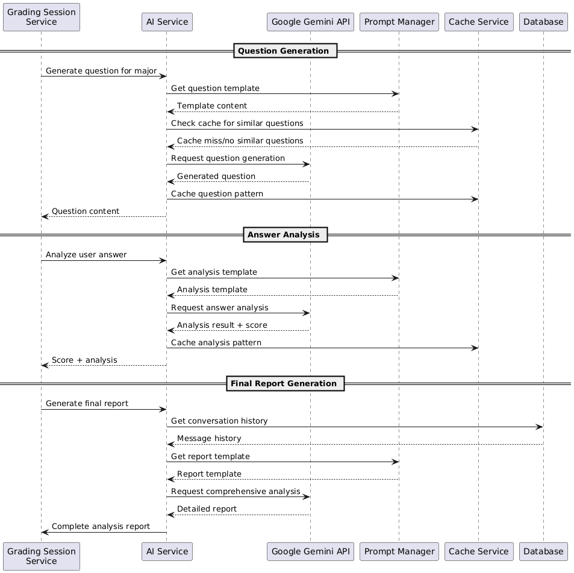
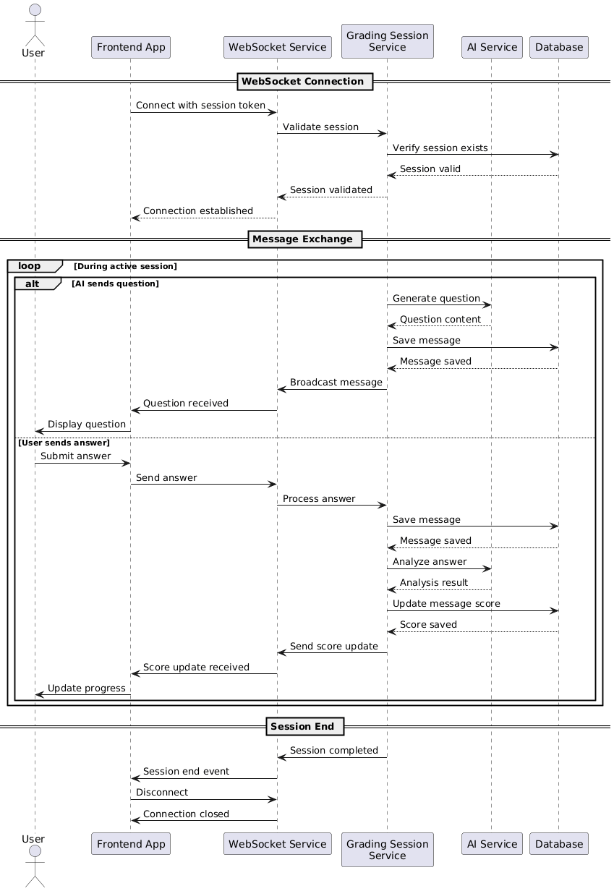
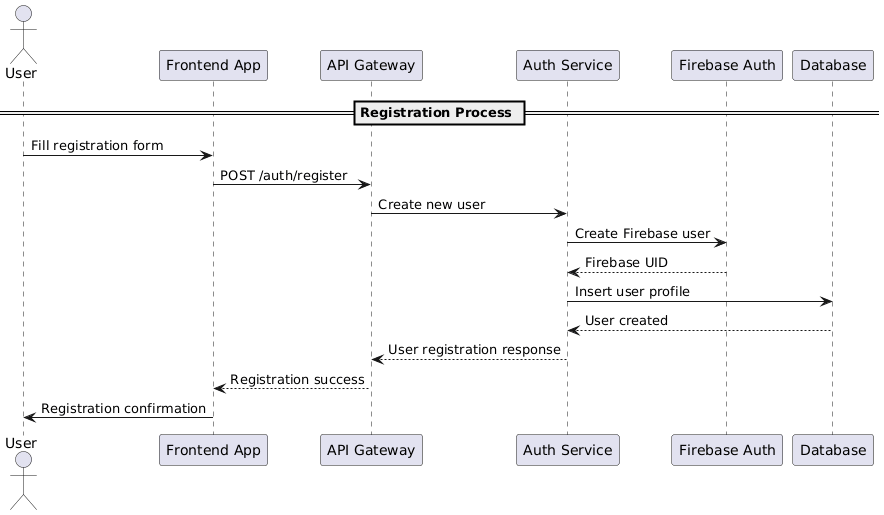

# AI Essay Preparedness Grader - System Architecture Overview

## Project Description

AI Essay Preparedness Grader adalah fitur inovatif untuk platform web ProdiPlan.id yang menggunakan kecerdasan buatan dalam bentuk conversational agent untuk menganalisis esai jawaban siswa mengenai jurusan kuliah pilihan mereka. Tujuan utama adalah untuk mengetahui apakah siswa benar-benar siap menjalani hidup di jurusan tersebut, mengurangi risiko salah pilih jurusan, dan memberikan gambaran yang lebih realistis kepada calon mahasiswa.

## System Overview

Sistem ini dirancang dengan arsitektur microservices untuk memastikan skalabilitas, maintainability, dan fleksibilitas. Setiap service memiliki tanggung jawab spesifik dan dapat dikembangkan secara independen.

## Core Services

### 1. Auth Service
- **Responsibility**: Autentikasi dan autorisasi pengguna
- **Integration**: Firebase Authentication
- **Key Features**:
  - User registration dan login
  - Token management
  - Profile management
  - Session validation

### 2. Grading Session Service
- **Responsibility**: Mengelola sesi grading aktif
- **Key Features**:
  - Membuat instance grading session
  - Melacak progress sesi
  - Mengelola state sesi (active, completed, expired)
  - Session timeout management

### 3. AI Service
- **Responsibility**: Interaksi dengan AI untuk analisis esai
- **Integration**: Google Gemini API
- **Key Features**:
  - Conversational agent untuk bertanya jawab
  - Analisis esai real-time
  - Scoring algorithm
  - Threshold evaluation

### 4. Result Service
- **Responsibility**: Mengelola hasil analisis dan laporan
- **Key Features**:
  - Menyimpan hasil grading
  - Generate laporan komprehensif
  - Result retrieval
  - History management

### 5. WebSocket Service
- **Responsibility**: Komunikasi real-time antara client dan server
- **Key Features**:
  - Real-time chat interface
  - Live scoring updates
  - Session state synchronization
  - Connection management

### 6. Admin Service
- **Responsibility**: Manajemen sistem administratif
- **Key Features**:
  - User management
  - System monitoring
  - Analytics dashboard
  - Configuration management

## Data Flow Architecture

## Technology Stack Recommendation

### Backend
- **Framework**: Node.js dengan Express.js atau NestJS
- **Database**: PostgreSQL untuk relational data
- **Cache**: Redis untuk session management dan caching
- **Message Queue**: RabbitMQ atau Apache Kafka untuk inter-service communication
- **WebSocket**: Socket.io untuk real-time communication

### Frontend
- **Framework**: React.js atau Next.js
- **State Management**: Redux Toolkit atau Zustand
- **UI Components**: shadcn/ui atau Material-UI
- **Real-time**: Socket.io client

### Infrastructure
- **Containerization**: Docker
- **Orchestration**: Kubernetes
- **CI/CD**: GitHub Actions atau GitLab CI
- **Monitoring**: Prometheus dan Grafana
- **Logging**: ELK Stack (Elasticsearch, Logstash, Kibana)

### External Services
- **Authentication**: Firebase Authentication
- **AI Service**: Google Gemini API
- **File Storage**: Google Cloud Storage atau AWS S3
- **Email Service**: SendGrid atau AWS SES

## Security Considerations

### Authentication & Authorization
- JWT-based authentication dengan refresh token
- Role-based access control (RBAC)
- OAuth 2.0 integration dengan Firebase

### Data Protection
- Encryption data in transit (HTTPS/TLS)
- Encryption data at rest
- PII data masking untuk sensitive information
- GDPR compliance untuk data protection

### API Security
- Rate limiting untuk mencegah abuse
- Input validation dan sanitization
- CORS configuration
- API key management untuk external services

## Scalability Considerations

### Horizontal Scaling
- Stateless service design
- Load balancing dengan Nginx atau AWS ALB
- Database read replicas
- Caching strategy dengan Redis

### Performance Optimization
- Database indexing strategy
- Connection pooling
- Lazy loading untuk data yang tidak kritis
- CDN untuk static assets

## Monitoring & Observability

### Health Checks
- Service health endpoints
- Database connectivity checks
- External service dependency monitoring
- Custom metrics untuk business logic

### Logging Strategy
- Structured logging dengan JSON format
- Centralized logging system
- Log levels yang sesuai (error, warn, info, debug)
- Correlation ID untuk request tracing

## System Diagrams

### Data Flow Architecture

### Entity Relationship Diagram

### Sequence Diagrams

#### AI Service Integration Flow

#### Complete Grading Session Sequence

#### Realtime Communication

#### User Registration Flow

## Next Steps

1. Detailed database design dengan ERD
2. API specification dengan OpenAPI/Swagger
3. Service contract definition
4. Deployment architecture detail
5. Security implementation plan
6. Performance testing strategy