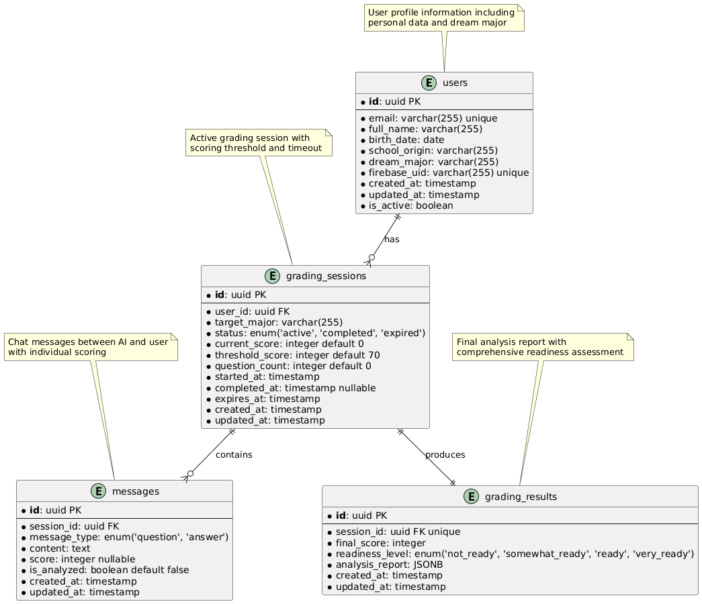
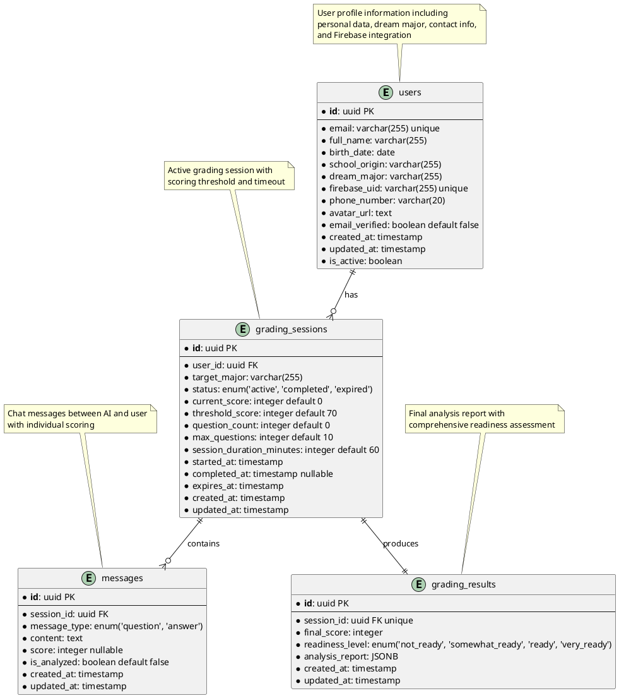

# ERD (Entity Relationship Diagram) - AI Essay Preparedness Grader

**Version**: 1.2  
**Last Updated**: November 2025  
**Purpose**: Complete database schema for user profiles, grading sessions, messages, and results

## ERD Visualization

## PlantUML ERD Diagram

## Entity Descriptions

### Users Table
Menyimpan data profil pengguna yang terdaftar dalam sistem.

**Fields:**
- `id`: Primary key unik untuk setiap user
- `email`: Email unik user untuk login
- `full_name`: Nama lengkap user
- `birth_date`: Tanggal lahir user
- `school_origin`: Asal sekolah user
- `dream_major`: Jurusan impian user (dari profile)
- `firebase_uid`: UID dari Firebase Authentication
- `phone_number`: Nomor telepon user (optional)
- `avatar_url`: URL avatar/foto profil user (optional)
- `email_verified`: Status verifikasi email dari Firebase
- `created_at`: Timestamp pembuatan record
- `updated_at`: Timestamp update terakhir
- `is_active`: Status aktif user

### Grading Sessions Table
Menyimpan sesi grading aktif untuk setiap user.

**Fields:**
- `id`: Primary key unik untuk setiap sesi
- `user_id`: Foreign key ke tabel users
- `target_major`: Jurusan yang dituju untuk sesi ini (bisa berbeda dengan dream_major)
- `status`: Status sesi (active, completed, expired)
- `current_score`: Skor akumulasi saat ini
- `threshold_score`: Threshold skor untuk menyelesaikan sesi
- `question_count`: Jumlah pertanyaan yang telah diajukan
- `max_questions`: Jumlah maksimal pertanyaan dalam sesi
- `session_duration_minutes`: Durasi sesi dalam menit
- `started_at`: Timestamp mulai sesi
- `completed_at`: Timestamp selesai sesi (nullable)
- `expires_at`: Timestamp kedaluwarsa sesi
- `created_at`: Timestamp pembuatan record
- `updated_at`: Timestamp update terakhir

### Messages Table
Menyimpan pesan-pesan dalam sesi grading.

**Fields:**
- `id`: Primary key unik untuk setiap pesan
- `session_id`: Foreign key ke tabel grading_sessions
- `message_type`: Tipe pesan (question/answer)
- `content`: Isi pesan
- `score`: Skor untuk jawaban user (nullable)
- `is_analyzed`: Status apakah pesan sudah dianalisis AI
- `created_at`: Timestamp pembuatan record
- `updated_at`: Timestamp update terakhir

### Grading Results Table
Menyimpan hasil akhir analisis grading session.

**Fields:**
- `id`: Primary key unik untuk setiap hasil
- `session_id`: Foreign key ke tabel grading_sessions (unique)
- `final_score`: Skor akhir dari sesi
- `readiness_level`: Level kesiapan user
- `analysis_report`: Laporan analisis komprehensif dalam format JSONB (fleksibel untuk kebutuhan klien yang berubah)
- `created_at`: Timestamp pembuatan record
- `updated_at`: Timestamp update terakhir

## Relationship Details

### Users to Grading Sessions (One-to-Many)
- Satu user dapat memiliki multiple grading sessions
- Setiap grading session dimiliki oleh satu user
- Relationship: `users.id` → `grading_sessions.user_id`

### Grading Sessions to Messages (One-to-Many)
- Satu grading session dapat memiliki multiple messages
- Setiap message terkait dengan satu grading session
- Relationship: `grading_sessions.id` → `messages.session_id`

### Grading Sessions to Grading Results (One-to-One)
- Satu grading session menghasilkan satu grading result
- Setiap grading result terkait dengan satu grading session
- Relationship: `grading_sessions.id` → `grading_results.session_id`

## Indexing Strategy

### Primary Keys
- Semua tabel menggunakan UUID sebagai primary key untuk distribusi yang lebih baik

### Foreign Keys
- `grading_sessions.user_id` → index untuk query cepat berdasarkan user
- `messages.session_id` → index untuk retrieval pesan per sesi
- `grading_results.session_id` → unique index untuk one-to-one relationship

### Additional Indexes
- `users.email` → unique index untuk login
- `users.firebase_uid` → unique index untuk Firebase integration
- `users.email_verified` → index untuk filtering verified users
- `grading_sessions.status` → index untuk filtering active sessions
- `grading_sessions.expires_at` → index untuk cleanup expired sessions
- `messages.created_at` → index untuk chronological ordering
- `grading_results.created_at` → index untuk result history

## Data Validation Rules

### Users
- Email harus valid dan unique
- Firebase UID harus unique
- Birth date tidak boleh di masa depan
- Phone number harus format valid jika diisi (optional)
- Avatar URL harus valid URL jika diisi (optional)
- Email verified harus boolean (default false)

### Grading Sessions
- Target major tidak boleh kosong
- Status harus valid enum value
- Current score tidak boleh negatif
- Expires_at harus setelah started_at

### Messages
- Content tidak boleh kosong
- Message_type harus valid enum value
- Score hanya untuk message_type 'answer'

### Grading Results
- Final score harus antara 0-100
- Readiness_level harus valid enum value
- Analysis_report tidak boleh kosong

---

## Update History

### Version 1.2 - November 2025
- Added `max_questions` field to grading_sessions table (INTEGER DEFAULT 10)
- Added `session_duration_minutes` field to grading_sessions table (INTEGER DEFAULT 60)
- Updated PlantUML diagram and entity descriptions

**Reason**: Align ERD with API Specification requirements for grading session management.

### Version 1.1 - November 2025
- Added `phone_number` field to users table (VARCHAR(20))
- Added `avatar_url` field to users table (TEXT)
- Added `email_verified` field to users table (BOOLEAN DEFAULT false)
- Updated validation rules for new user fields
- Added index for `users.email_verified`
- Updated PlantUML diagram and entity descriptions

**Reason**: Align ERD with API Specification requirements for complete user profile data.