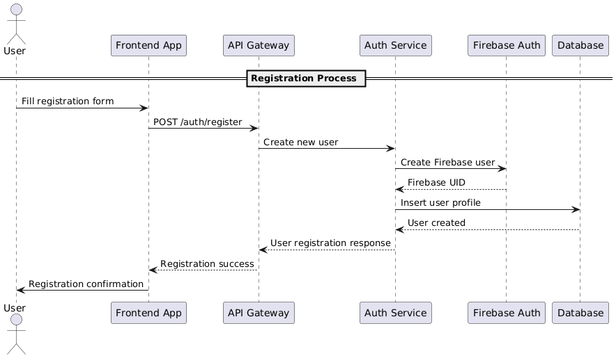
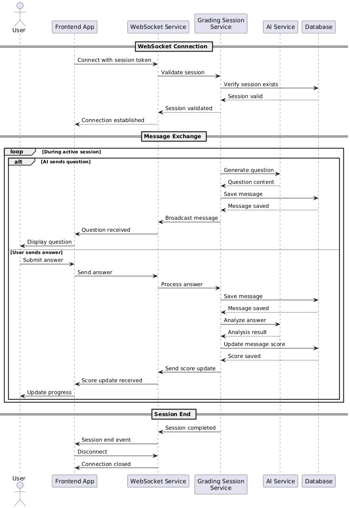

# Sequential Diagrams - AI Essay Preparedness Grader

## Sequence Diagram Visualizations

### Complete Grading Session Sequence

### User Registration Flow

### Realtime Communication Sequence

### AI Service Integration Flow

## 1. Complete Grading Session Flow

```plantuml
@startuml Grading_Session_Complete_Flow

actor User
participant "Frontend App" as FE
participant "API Gateway" as API
participant "Auth Service" as Auth
participant "Grading Session\nService" as GS
participant "WebSocket Service" as WS
participant "AI Service" as AI
participant "Google Gemini API" as Gemini
participant "Result Service" as RS
participant "Database" as DB

== User Authentication ==
User -> FE: Login with credentials
FE -> API: POST /auth/login
API -> Auth: Validate credentials
Auth -> DB: Verify user data
DB --> Auth: User information
Auth --> API: JWT token + user data
API --> FE: Authentication response
FE --> User: Login successful

== Start Grading Session ==
User -> FE: Start new grading session
FE -> API: POST /grading-sessions (with JWT)
API -> Auth: Validate JWT
Auth --> API: Token valid
API -> GS: Create new session
GS -> DB: Insert grading session
DB --> GS: Session ID
GS --> API: Session created
API --> FE: Session response
FE -> WS: Connect to WebSocket
WS --> FE: Connection established

== AI Conversation Loop ==
loop Until threshold reached or max questions
    GS -> AI: Generate initial question
    AI -> Gemini: Request question generation
    Gemini --> AI: Generated question
    AI --> GS: Question content
    GS -> DB: Save question message
    DB --> GS: Message saved
    GS -> WS: Send question to client
    WS -> FE: Question message
    FE -> User: Display question
    
    User -> FE: Submit answer
    FE -> WS: Send answer
    WS -> GS: Receive answer
    GS -> DB: Save answer message
    DB --> GS: Message saved
    
    GS -> AI: Analyze answer
    AI -> Gemini: Request answer analysis
    Gemini --> AI: Analysis result + score
    AI --> GS: Score + analysis
    GS -> DB: Update message with score
    DB --> GS: Score saved
    GS -> DB: Update session score
    DB --> GS: Session updated
    
    alt Score >= threshold
        GS -> GS: Mark session as completed
        break
    else Score < threshold AND questions < max
        GS -> GS: Continue conversation
    else Max questions reached
        GS -> GS: Mark session as completed
        break
    end
end

== Generate Final Report ==
GS -> AI: Request final analysis
AI -> Gemini: Send conversation history
Gemini --> AI: Comprehensive analysis
AI --> GS: Analysis report
GS -> RS: Create grading result
RS -> DB: Save grading result
DB --> RS: Result saved
RS --> GS: Result ID
GS -> DB: Update session status
DB --> GS: Session completed

== Notify User ==
GS -> WS: Send session completed
WS -> FE: Session completed event
FE -> API: GET /grading-results/{sessionId}
API -> RS: Retrieve result
RS -> DB: Query result
DB --> RS: Result data
RS --> API: Result response
API --> FE: Result data
FE -> User: Display comprehensive report

@enduml
```

## 2. User Registration Flow

```plantuml
@startuml User_Registration_Flow

actor User
participant "Frontend App" as FE
participant "API Gateway" as API
participant "Auth Service" as Auth
participant "Firebase Auth" as Firebase
participant "Database" as DB

== Registration Process ==
User -> FE: Fill registration form
FE -> API: POST /auth/register
API -> Auth: Create new user
Auth -> Firebase: Create Firebase user
Firebase --> Auth: Firebase UID
Auth -> DB: Insert user profile
DB --> Auth: User created
Auth --> API: User registration response
API --> FE: Registration success
FE -> User: Registration confirmation

@enduml
```

## 3. Real-time Communication Flow

```plantuml
@startuml Realtime_Communication_Flow

actor User
participant "Frontend App" as FE
participant "WebSocket Service" as WS
participant "Grading Session\nService" as GS
participant "AI Service" as AI
participant "Database" as DB

== WebSocket Connection ==
FE -> WS: Connect with session token
WS -> GS: Validate session
GS -> DB: Verify session exists
DB --> GS: Session valid
GS --> WS: Session validated
WS --> FE: Connection established

== Message Exchange ==
loop During active session
    alt AI sends question
        GS -> AI: Generate question
        AI --> GS: Question content
        GS -> DB: Save message
        DB --> GS: Message saved
        GS -> WS: Broadcast message
        WS -> FE: Question received
        FE -> User: Display question
    else User sends answer
        User -> FE: Submit answer
        FE -> WS: Send answer
        WS -> GS: Process answer
        GS -> DB: Save message
        DB --> GS: Message saved
        GS -> AI: Analyze answer
        AI --> GS: Analysis result
        GS -> DB: Update message score
        DB --> GS: Score saved
        GS -> WS: Send score update
        WS -> FE: Score update received
        FE -> User: Update progress
    end
end

== Session End ==
GS -> WS: Session completed
WS -> FE: Session end event
FE -> WS: Disconnect
WS -> FE: Connection closed

@enduml
```

## 4. AI Service Integration Flow

```plantuml
@startuml AI_Service_Integration_Flow

participant "Grading Session\nService" as GS
participant "AI Service" as AI
participant "Google Gemini API" as Gemini
participant "Prompt Manager" as PM
participant "Cache Service" as CS
participant "Database" as DB

== Question Generation ==
GS -> AI: Generate question for major
AI -> PM: Get question template
PM --> AI: Template content
AI -> CS: Check cache for similar questions
CS --> AI: Cache miss/no similar questions
AI -> Gemini: Request question generation
Gemini --> AI: Generated question
AI -> CS: Cache question pattern
AI --> GS: Question content

== Answer Analysis ==
GS -> AI: Analyze user answer
AI -> PM: Get analysis template
PM --> AI: Analysis template
AI -> Gemini: Request answer analysis
Gemini --> AI: Analysis result + score
AI -> CS: Cache analysis pattern
AI --> GS: Score + analysis

== Final Report Generation ==
GS -> AI: Generate final report
AI -> DB: Get conversation history
DB --> AI: Message history
AI -> PM: Get report template
PM --> AI: Report template
AI -> Gemini: Request comprehensive analysis
Gemini --> AI: Detailed report
AI -> GS: Complete analysis report

@enduml
```

## 5. Error Handling and Recovery Flow

```plantuml
@startuml Error_Handling_Flow

actor User
participant "Frontend App" as FE
participant "API Gateway" as API
participant "Grading Session\nService" as GS
participant "AI Service" as AI
participant "WebSocket Service" as WS
participant "Database" as DB

== AI Service Error ==
GS -> AI: Analyze answer
AI -> AI: Error processing request
AI --> GS: Error response
GS -> DB: Log error
DB --> GS: Error logged
GS -> WS: Send error notification
WS -> FE: Error message
FE -> User: Display error message
FE -> GS: Request retry
GS -> AI: Retry analysis
alt Retry successful
    AI --> GS: Analysis result
    GS -> WS: Send result
    WS -> FE: Success response
else Retry failed
    AI --> GS: Error response
    GS -> DB: Mark session as failed
    DB --> GS: Session updated
    GS -> WS: Session failed
    WS -> FE: Session failed
    FE -> User: Display session failed
end

== Database Connection Error ==
GS -> DB: Save message
DB -> DB: Connection error
DB --> GS: Connection failed
GS -> GS: Implement retry logic
GS -> DB: Retry connection
alt Connection restored
    DB --> GS: Connection successful
    GS -> DB: Save message
    DB --> GS: Message saved
else Connection still failed
    GS -> WS: Notify service degradation
    WS -> FE: Service warning
    FE -> User: Display service warning
    GS -> GS: Queue operation for later
end

== WebSocket Disconnection ==
WS -> FE: Send message
FE -> FE: Connection lost
FE -> WS: Attempt reconnection
WS -> FE: Connection restored
FE -> WS: Request missed messages
WS -> GS: Get message history
GS -> DB: Query messages
DB --> GS: Message history
GS --> WS: Message data
WS -> FE: Missed messages
FE -> User: Update interface

@enduml
```

## 6. Session Timeout and Cleanup Flow

```plantuml
@startuml Session_Timeout_Flow

participant "Scheduler Service" as SS
participant "Grading Session\nService" as GS
participant "Database" as DB
participant "WebSocket Service" as WS
participant "Result Service" as RS
participant "AI Service" as AI

== Scheduled Cleanup ==
SS -> GS: Check for expired sessions
GS -> DB: Query active sessions past expiry
DB --> GS: List of expired sessions

loop For each expired session
    GS -> WS: Disconnect WebSocket if active
    WS --> GS: Disconnection confirmed
    GS -> DB: Update session status to 'expired'
    DB --> GS: Session updated
    
    alt Session has partial data
        GS -> AI: Request partial analysis
        AI --> GS: Partial analysis
        GS -> RS: Create incomplete result
        RS -> DB: Save partial result
        DB --> RS: Result saved
        RS --> GS: Result ID
        GS -> DB: Link result to session
        DB --> GS: Link created
    end
end

GS -> SS: Cleanup completed
SS -> SS: Schedule next cleanup run

@enduml
```

## Flow Descriptions

### 1. Complete Grading Session Flow
Diagram ini menunjukkan alur lengkap dari awal hingga akhir sesi grading, mulai dari autentikasi user, pembuatan sesi, percakapan dengan AI, hingga generasi laporan akhir.

### 2. User Registration Flow
Menunjukkan proses pendaftaran user baru dengan integrasi Firebase Authentication dan penyimpanan data profil ke database.

### 3. Real-time Communication Flow
Detail implementasi WebSocket untuk komunikasi real-time antara frontend dan backend selama sesi grading aktif.

### 4. AI Service Integration Flow
Menunjukkan integrasi dengan Google Gemini API untuk generasi pertanyaan, analisis jawaban, dan pembuatan laporan akhir.

### 5. Error Handling and Recovery Flow
Menunjukkan berbagai skenario error dan mekanisme recovery untuk memastikan sistem tetap berjalan dengan baik.

### 6. Session Timeout and Cleanup Flow
Proses otomatis untuk menangani sesi yang kedaluwarsa dan cleanup data yang tidak diperlukan.
jadi pada dokumentasi ini.
## Key Integration Points

1. **Authentication**: Firebase Auth integration untuk user management
2. **Real-time Communication**: WebSocket untuk interaksi real-time
3. **AI Processing**: Google Gemini API untuk analisis esai
4. **Data Persistence**: PostgreSQL untuk data storage
5. **Caching**: Redis untuk performance optimization
6. **Monitoring**: Analytics service untuk system monitoring

## Performance Considerations

1. **Connection Pooling**: Database connection management
2. **Caching Strategy**: AI response caching untuk reduce API calls
3. **Load Balancing**: Distribute load across multiple service instances
4. **Async Processing**: Non-blocking operations untuk AI service calls
5. **Rate Limiting**: Prevent abuse dan ensure fair usage