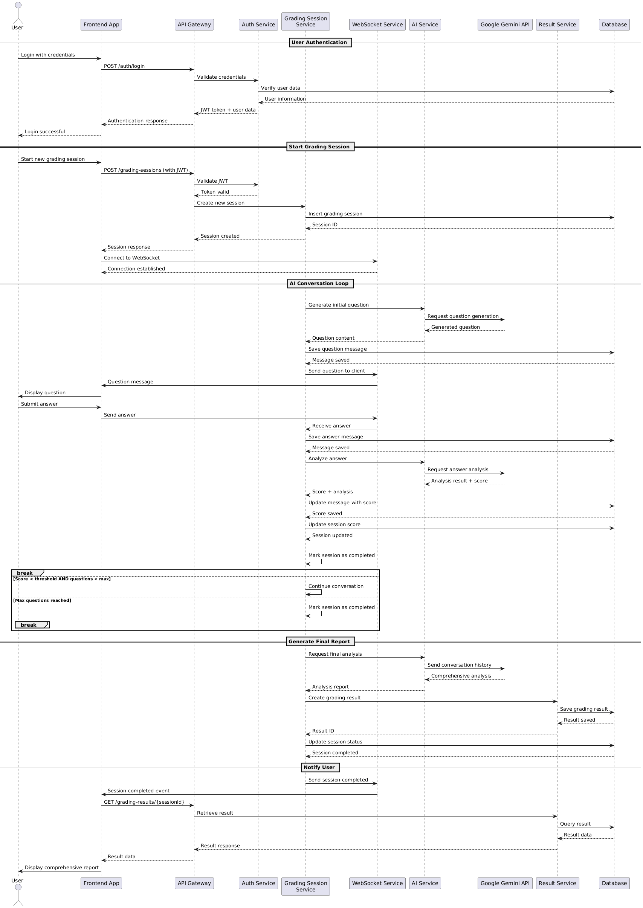
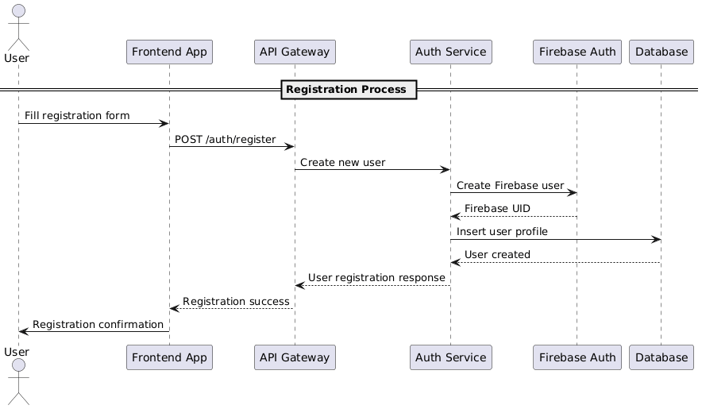
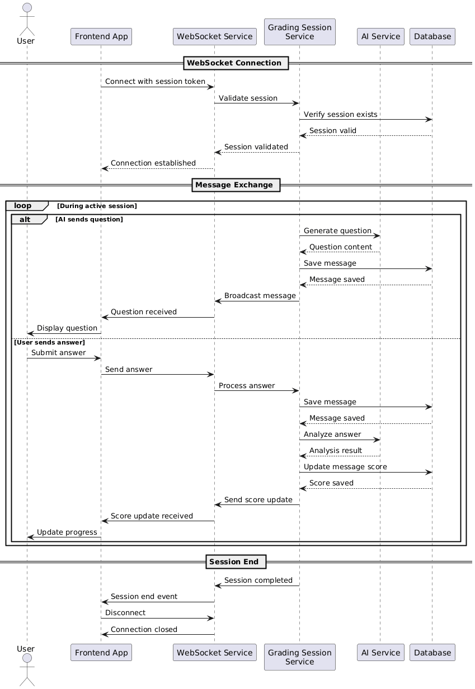
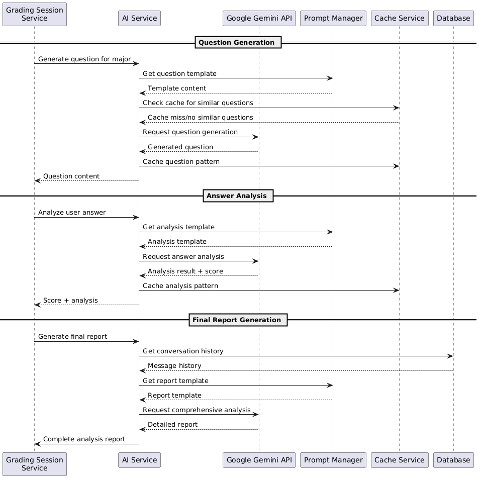
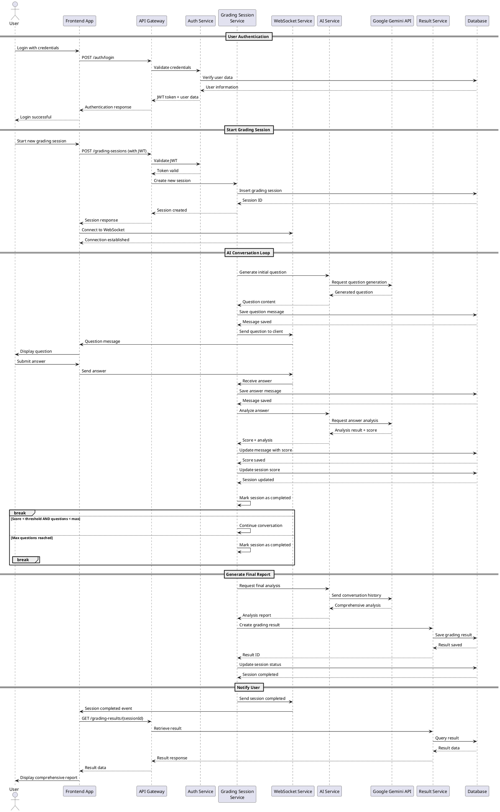
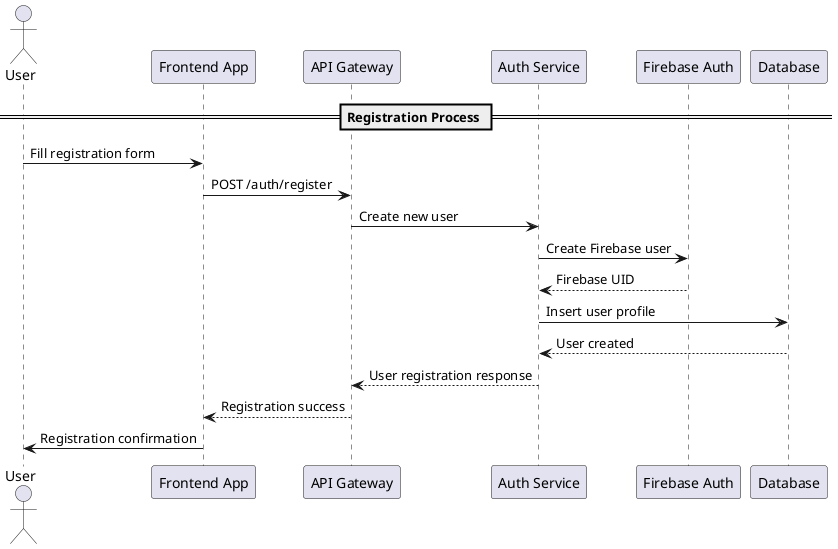
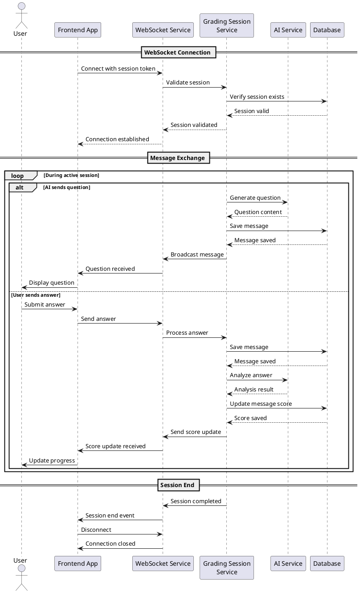
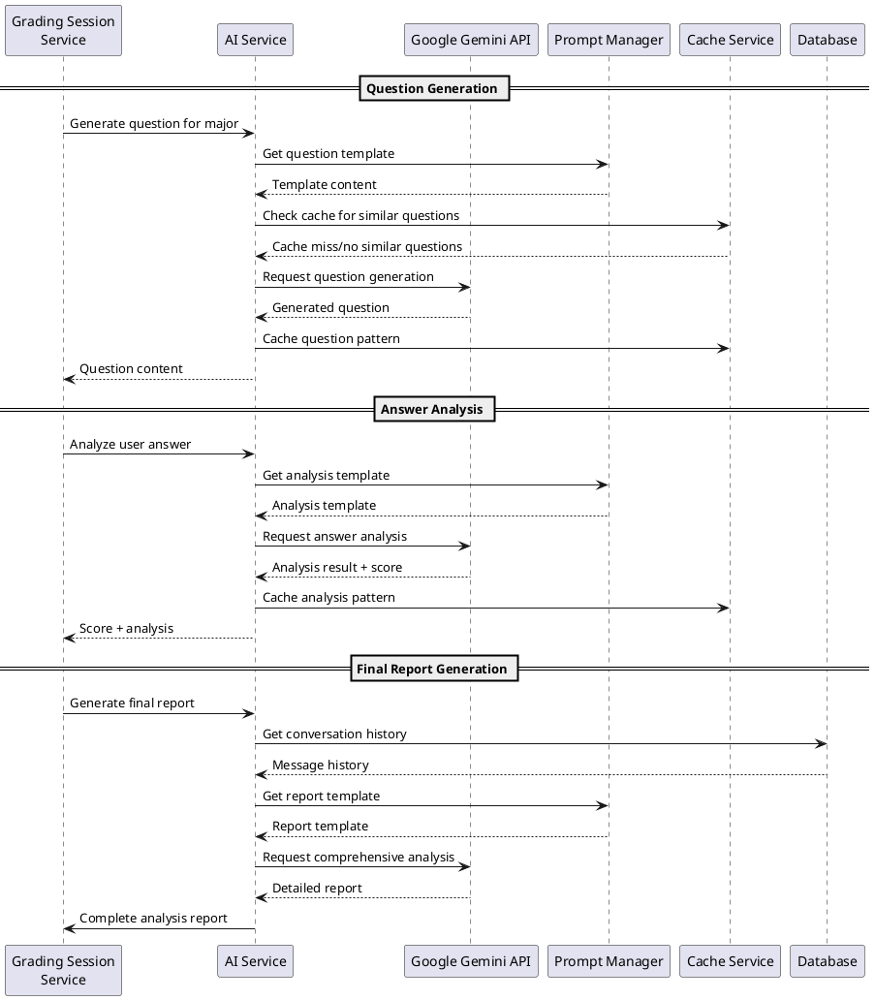
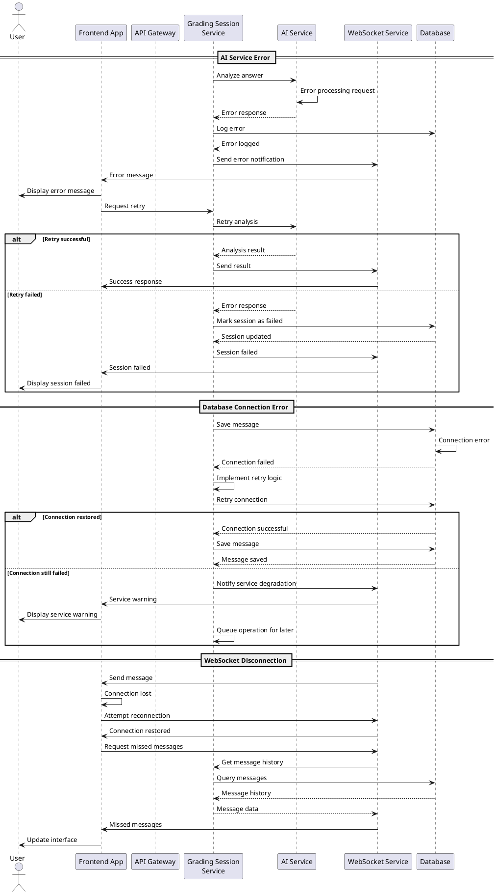
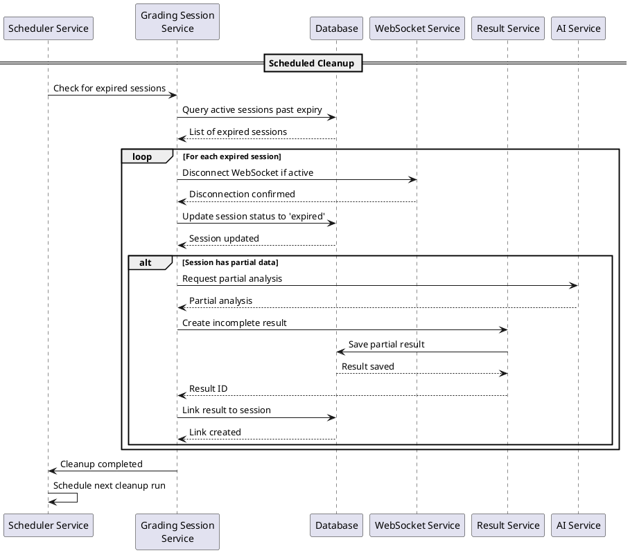

# Sequential Diagrams - AI Essay Preparedness Grader

## Sequence Diagram Visualizations

### Complete Grading Session Sequence

### User Registration Flow

### Realtime Communication Sequence

### AI Service Integration Flow

## 1. Complete Grading Session Flow

## 2. User Registration Flow

## 3. Real-time Communication Flow

## 4. AI Service Integration Flow

## 5. Error Handling and Recovery Flow

## 6. Session Timeout and Cleanup Flow

## Flow Descriptions

### 1. Complete Grading Session Flow
Diagram ini menunjukkan alur lengkap dari awal hingga akhir sesi grading, mulai dari autentikasi user, pembuatan sesi, percakapan dengan AI, hingga generasi laporan akhir.

### 2. User Registration Flow
Menunjukkan proses pendaftaran user baru dengan integrasi Firebase Authentication dan penyimpanan data profil ke database.

### 3. Real-time Communication Flow
Detail implementasi WebSocket untuk komunikasi real-time antara frontend dan backend selama sesi grading aktif.

### 4. AI Service Integration Flow
Menunjukkan integrasi dengan Google Gemini API untuk generasi pertanyaan, analisis jawaban, dan pembuatan laporan akhir.

### 5. Error Handling and Recovery Flow
Menunjukkan berbagai skenario error dan mekanisme recovery untuk memastikan sistem tetap berjalan dengan baik.

### 6. Session Timeout and Cleanup Flow
Proses otomatis untuk menangani sesi yang kedaluwarsa dan cleanup data yang tidak diperlukan.
jadi pada dokumentasi ini.
## Key Integration Points

1. **Authentication**: Firebase Auth integration untuk user management
2. **Real-time Communication**: WebSocket untuk interaksi real-time
3. **AI Processing**: Google Gemini API untuk analisis esai
4. **Data Persistence**: PostgreSQL untuk data storage
5. **Caching**: Redis untuk performance optimization
6. **Monitoring**: Analytics service untuk system monitoring

## Performance Considerations

1. **Connection Pooling**: Database connection management
2. **Caching Strategy**: AI response caching untuk reduce API calls
3. **Load Balancing**: Distribute load across multiple service instances
4. **Async Processing**: Non-blocking operations untuk AI service calls
5. **Rate Limiting**: Prevent abuse dan ensure fair usage